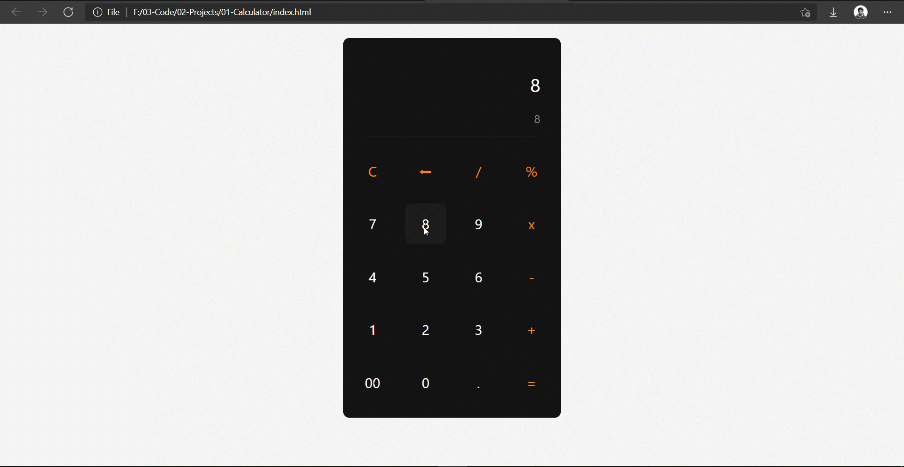

# Calculator 
This is a simple calculator built with Pure *HTML,* *CSS,* and *JS*

       &ensp;
       
 

## Prerequistes

Basics of HTML, CSS, JavaScript and desire to create something new.
 
 

## What you'll Learn

* CSS flexbox and grid layout
* JS array methods
* Logical Thinking
* DOM Manipulations

## [Case Study](https://dev.to/karankmr/create-a-simple-calculator-using-vanilla-javascript-step-by-step-2fpa)

Full Process of project is explained step by step in my blog post. [Check full case study on dev.to](https://dev.to/karankmr/create-a-simple-calculator-using-vanilla-javascript-step-by-step-2fpa)

---

##  Find Me On

<a href="https://www.instagram.com/karancodes/">Instagram</a> &ensp;
<a href="https://codepen.io/karan-kmr">Codepen</a> &ensp;
<a href="https://dev.to/karankmr">Dev.to</a> &ensp;

